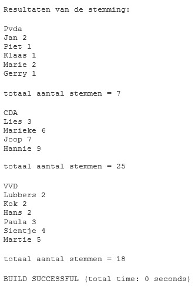

### Opdracht: 

Bij deze opgave maakt u een simulatieprogramma waarbij u 50x automatisch een stem invult.
Tevens maakt u classes om het stemmen en om de resultaten daarvan weer te geven.

### U maakt gebruik van de volgende gegevens.

* Er is een kieslijst met partijen.
* Een partij heeft een naam en staat in volgorde (heeft dus een nummer) op een kieslijst.
* Een partij heeft kandidaten.
* De kandidaten hebben een naam en staan in volgorde op de partij(lijst).
* Er is een class Stemming deze heeft minimaal de volgende gegevens:
  * een tweedimensionaal array
  * de kieslijst.

Arrays zijn nog niet uitvoerig in de leerstof aan bod gekomen. Dat komt pas in het volgende hoofdonderwerp. Dit geldt ook voor de ArrayList class, die u goed kunt gebruiken in deze feedbackopdracht. Kijk daarom vast in het boek naar de paragrafen "Understanding Java Arrays" (p. 119) en "Understanding an ArrayList" (p. 129) voordat u deze opdracht gaat maken.
De class Stemming heeft minimaal de volgende methodes:
* RandomStemming() daar wordt precies 50 keer een stemming uit gebracht, door random een partij te kiezen en random uit die partij een kandidaat te kiezen.
* ShowStemming geeft de lijst weer in de output (mag met System.out.println)

run: 
Zeven rijen zijn weergegeven 
* De eerste kolom bevat het volgorde nummer.
* In de tweede kolom staat de partij (3 partijen).
* In de derde kolom staat de kandidaat uit die partij.
0 1 1
1 2 4
2 3 2
3 2 3
4 3 3
5 3 5
6 2 4

* voegStemmenToe: in deze methode wordt de stem van de kandidaat in de bewuste partij met één verhoogd.

De kieslijst heeft een methode om de lijst van partijen en kandidaten terug te geven.  In de testclass wordt deze lijst naar de output geschreven.

**Succes!**

De package-directory met daarin de Java-bestanden dient te worden gezipt, zodat deze kan worden ingestuurd.

Voor deze programmeeropdracht zijn in totaal 90 punten te behalen.